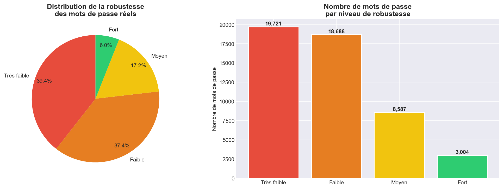
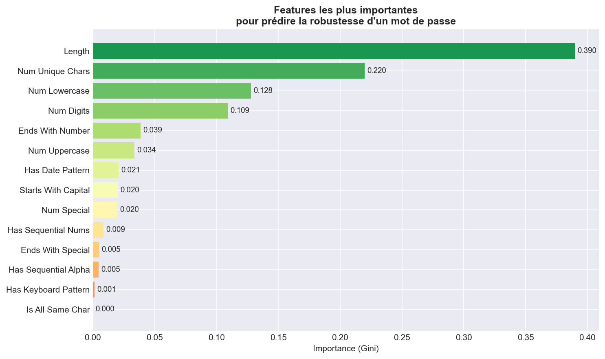

# 🔐 Analyseur de Mots de Passe par IA


[](https://creativecommons.org/licenses/by-nc/4.0/)

Système d'analyse automatique de la robustesse des mots de passe 
par intelligence artificielle, entraîné sur 50 000 mots de passe 
réels issus de la fuite RockYou (2009).

## 🎯 Objectifs

- Analyser la distribution de robustesse de mots de passe réels
- Extraire des features pertinentes (longueur, composition, patterns)
- Entraîner un modèle IA de classification (Gradient Boosting)
- Identifier et corriger le Data Leakage
- Générer un rapport PDF professionnel automatiquement

## 📊 Résultats clés

| Métrique | Valeur |
|---|---|
| Dataset | 50 000 mots de passe (rockyou.txt) |
| Features | 14 features extraites |
| Modèle retenu | Gradient Boosting Classifier |
| Accuracy (CV 5-fold) | 66.94% ± 0.18% |
| Mots de passe faibles détectés | 76.8% du dataset |

> **Note sur l'accuracy :** Un score de 66.94% sur 5 classes 
> (baseline aléatoire = 20%) est honnête et valide. 
> Les premières versions atteignaient 100% — du au Data Leakage, 
> identifié et corrigé.

## 🗂️ Structure du projet
```
Password_Analyzer/
├── data/samples/          # Échantillon anonymisé (sans mots de passe réels)
├── notebooks/             # Jupyter Notebooks d'analyse
├── src/
│   ├── password_features.py   # Extraction de features
│   ├── model_trainer.py       # Entraînement du modèle
│   └── report_generator.py    # Génération du rapport PDF
├── reports/figures/       # Graphiques générés
├── requirements.txt
└── README.md
```

## 🚀 Installation et utilisation
```bash
# 1. Cloner le projet
git clone https://github.com/abderemaneattoumani/Password_Analyzer.git
cd Password_Analyzer

# 2. Créer l'environnement virtuel
python -m venv venv
venv\Scripts\activate  # Windows
# source venv/bin/activate  # Linux/Mac

# 3. Installer les dépendances
pip install -r requirements.txt

# 4. Lancer l'analyse (nécessite rockyou.txt dans data/raw/)
python src/password_features.py
python src/model_trainer.py
python src/report_generator.py
```

## ☁️ Démonstration interactive

[](LIEN_COLAB_ICI)

Le notebook Google Colab permet de tester l'analyseur 
sans aucune installation locale.

## 🧠 Concepts clés abordés

- **Feature Engineering** — transformation d'une chaîne en vecteur numérique
- **Data Leakage** — identification et correction d'une fuite de données
- **Class Imbalance** — gestion du déséquilibre de classes (`class_weight='balanced'`)
- **Cross-Validation** — évaluation fiable par validation croisée 5-fold
- **Entropie** — mesure mathématique de l'imprévisibilité d'un mot de passe

## 📈 Graphiques

| Distribution | Importance des features |
|---|---|
|  |  |

## ⚙️ Stack technique

| Outil | Rôle |
|---|---|
| Python 3.11 | Langage principal |
| scikit-learn | Modèles ML |
| pandas / numpy | Manipulation des données |
| zxcvbn | Évaluation expert des mots de passe |
| matplotlib / seaborn | Visualisations |
| ReportLab | Génération PDF |

## 👤 Auteur

**[Ton Prénom Nom]**  
GitHub : [@abderemaneattoumani](https://github.com/abderemaneattoumani)

---
*Projet personnel — Cybersécurité & Machine Learning*